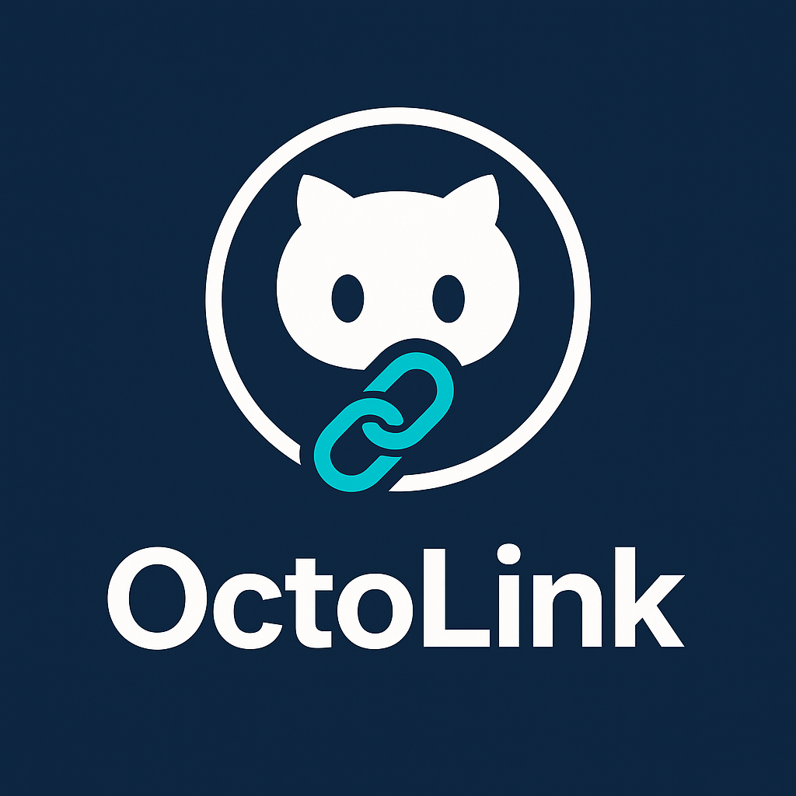

# 🐙 OctoLink

**Jump from VS Code to GitHub in one click.**

OctoLink is a Visual Studio Code extension that lets you instantly open your current file, line, or selection directly on GitHub — no manual browsing, no copy-paste URLs.  
It automatically detects your repository, branch, and selection to build the exact GitHub link for you.

---

## ✨ Features

| Feature | Description |
|----------|--------------|
| 🔗 **Open on GitHub** | Opens the current file on GitHub at the same branch and selection. |
| 🧭 **Copy Permalink** | Copies a permalink (commit-based URL) to the clipboard for easy sharing. |
| 🚀 **Open Related Pull Request** | Detects and opens the active branch’s pull request — or lets you create one instantly. |
| 📂 **Open Repo Dashboard** | Jump directly to Issues, Actions, or Discussions pages. |

---

## ⚙️ Installation

You can install **OctoLink** from the [Visual Studio Code Marketplace](https://marketplace.visualstudio.com/) or directly within VS Code:

1. Open **Extensions** (`Ctrl+Shift+X` or `Cmd+Shift+X`).
2. Search for **OctoLink**.
3. Click **Install**.
4. Profit 💰 (and speed).

---

## 🧩 Commands

| Command | Description |
|----------|-------------|
| `OctoLink: Open on GitHub (Branch)` | Opens the file on GitHub for the current branch. |
| `OctoLink: Open on GitHub (Permalink)` | Opens the file at the exact commit SHA. |
| `OctoLink: Copy Permalink` | Copies the permalink to your clipboard. |
| `OctoLink: Open Related PR` | Opens the GitHub pull request for the current branch (if any). |
| `OctoLink: Open Repo Dashboard` | Opens your GitHub repo’s main page, Issues, or Actions tab. |

You can access these from:
- The **Command Palette** (`Ctrl+Shift+P`)
- The **Editor title bar**
- The **File Explorer context menu**

---

## 💡 Why OctoLink?

- No need to switch tabs or navigate manually.  
- Works seamlessly with GitHub Enterprise and private repos.  
- Lightweight, fast, and built for developers who love clean tools.  
- Because the **Octocat deserves its own teleport button.**

---

## 🧱 Tech Stack

- **TypeScript**
- **VS Code Extension API**
- **Node.js Git Integration**
- **GitHub REST API**

---

## 🧑‍💻 Contributing

Contributions are more than welcome!  

1. Fork the repo  
2. Create your feature branch (`git checkout -b feature/amazing-thing`)  
3. Commit changes (`git commit -m 'Add amazing thing'`)  
4. Push your branch (`git push origin feature/amazing-thing`)  
5. Open a Pull Request 🚀  

---

## 🪪 License

MIT © [Emanuele Bartolesi](https://github.com/kasuken)

---

> Made with ❤️ and ☕ by developers, for developers.
